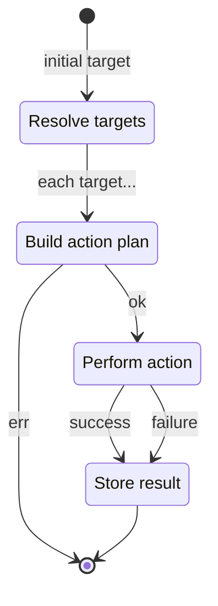

# Notes

## Diagrams

### Action Stream

## Target Parsing

Perform helpful speculation on what the given value may be. For example:

- Assume `arn:` prefixes are ARNs and parse them accordingly
- Assume `i-` prefixes are EC2
- Assume `-[a-z0-9]{10}-[a-z0-9]{5}` suffixes are K8s pods
- Assume IPv4 and IPv6 are SSH

## TODO

- Extract SSH factory from action into util
- Create a better concept for mapping targets to clients based on actions
