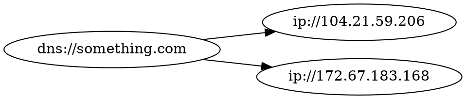
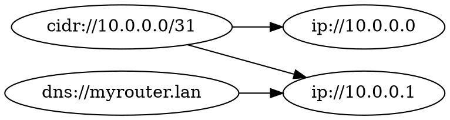

# Targets

A **target** is the basic unit of operation in Astu - it represents an object on which an action will be performed.

Targets are usually parsed from URIs, but they also support convenient short forms for common types. Not all target types support short forms; those that do will state so.

Here is an example long form for an IP target:

```
ip://127.0.0.1
```

While here is the equivalent short form for the same target:

```
127.0.0.1
```

Targets can be dynamically expanded and aggregated into other targets using [resolvers](./resolvers.md). The core Astu workflow revolves around dynamic target discovery using resolvers. Generally, one provides at least one seed target which is iteratively expanded using resolver chains.

[Clients](./clients.md) are drivers that perform actions on targets.

## Target Graph

A **target graph** is special target-centric data structure representing targets as a directed graph. Resolvers generally support resolving directly into a caller-provided target graph - this is useful for building a topological action plan.

Here's a simple example of the target graph for a DNS target that resolves to multiple different IP targets:



While here's a more complex example where targets have multiple parents. In this example, both the CIDR target `10.0.0.0/31` and the DNS target `myrouter.lan` point to the IP target `10.0.0.1`.



<!-- Links -->

[uri_grpc]: https://github.com/grpc/grpc/blob/ac90ebd310955024a188712b5231575e40dffcc5/doc/naming.md#detailed-design
[uri_ssh]: https://datatracker.ietf.org/doc/html/draft-salowey-secsh-uri-00
